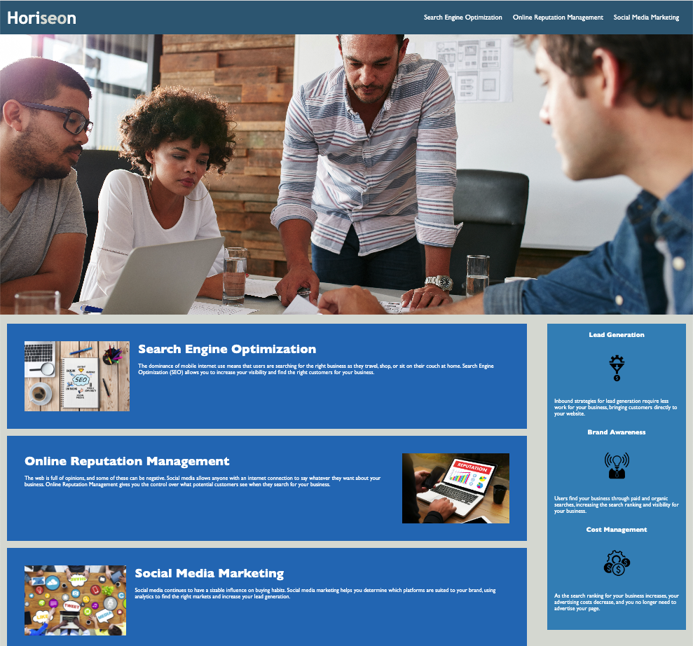

# Horiseon: Engine Optimization Refactor

## Description

The following website was refactored in order to make it more accessible.

In order to make it more accessible, the following was changed:
- renaming of classes in order to amalgamate content and sidebar sections to make it more readable;
- a reordering of headers, content and sidebar to make it more sequential;
- a more descriptive title was added;

Certain items were kept due to error messages. For example, lists in the header, while could be amalgamted, and had no effect on the website, produced an error, therefore, it was left as stated.

The website can be accessed at the following link: []

## Installation

N/A.

## Usage

The following is a screenshot of what the website looks like. It has been kept as close to the original as possible.mProvide instructions and examples for use. Include screenshots as needed.

To add a screenshot, create an `assets/images` folder in your repository and upload your screenshot to it. Then, using the relative filepath, add it to your README using the following syntax:

    

## Credits

MDN <h1>–<h6>: The HTML Section Heading elements 
[https://developer.mozilla.org/en-US/docs/Web/HTML/Element/Heading_Elements]

Stack Over Flow "How should I organize the contents of my CSS file(s)?" 
[https://stackoverflow.com/questions/146106/how-should-i-organize-the-contents-of-my-css-files]

## License

N/A